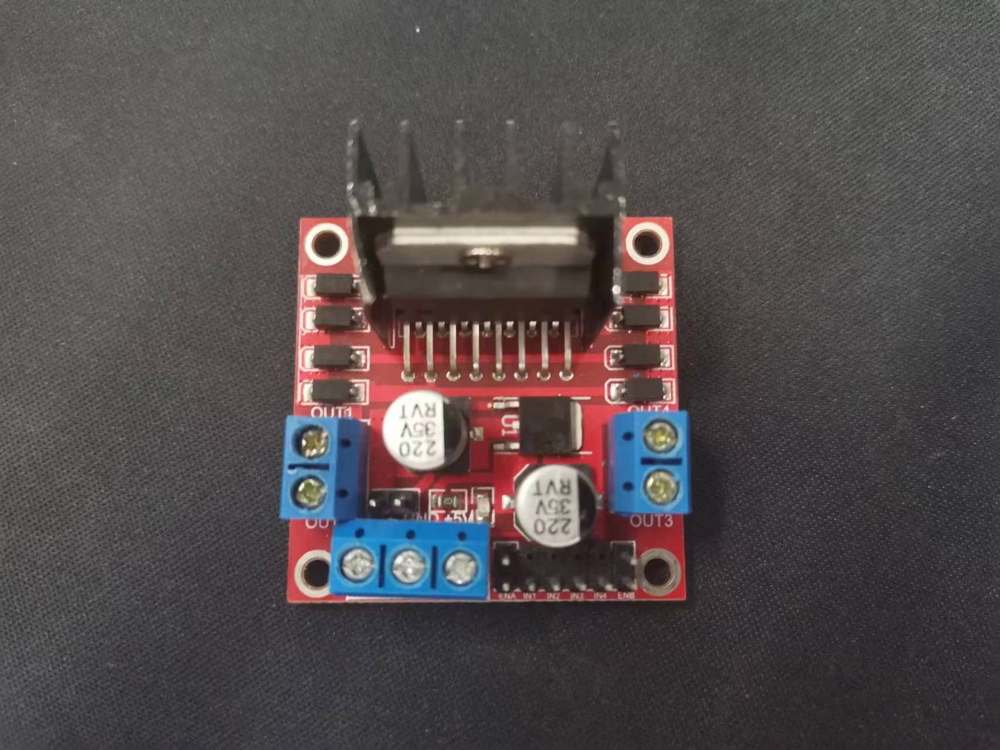

# 项目简介
本项目使用STM32VET6+L298N控制电动推杆,通过按键实现推杆上升和下降以及停止。 
## 开发环境 
### Vscode 
1. 安装EIDE插件
2. 新建项目->内置项目模板->STM32F1 Quickstart->工程名字->工程路径
3. 项目文件目录,src为主文件,包含了main.c和各模块头和源文件
 > 也可以使用KEIL5或其他软件,只需要将main.c和各模块文件复制过去即可
## 硬件设计 
1. STM32F10x 开发板
2. L298N

1. 电动推杆 

1. 12v DC电源
2. 硬件接线  
|  L298N  | STM32  |          推杆           | 电源  |
| :-----: | :----: | :---------------------: | :---: |
| OUT1/2- |        | 推杆电机的电压正/电压负 |       |
|  +12V   |        |                         |   +   |
|   GND   |  GND   |                         |   -   |
|   IN1   | GPIOA4 |                         |       |
|   IN2   | GPIO5  |                         |       |
## 软件设计
[L298N源文件](./src/L298N/l298n.c) 
[L298N头文件](./src/L298N/l298n.h)
## 下载验证
- 正常情况: 红灯亮, 推杆静止 
- 按下KEY1: 绿灯亮, 推杆上升 
- 按下KEY2: 蓝灯亮, 推杆下降 