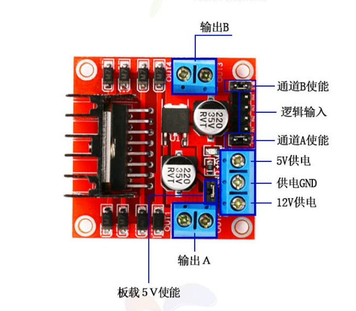
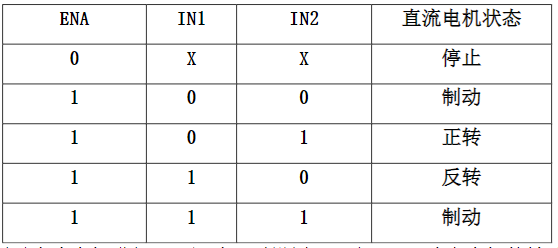

# 项目简介
本项目使用STM32VET6+L298N控制电动推杆,通过按键实现推杆上升和下降以及停止。 
## 开发环境 
### Vscode 
1. 安装EIDE插件
2. 新建项目->内置项目模板->STM32F1 Quickstart->工程名字->工程路径
3. 项目文件目录,src为主文件,包含了main.c和各模块头和源文件
 > 也可以使用KEIL5或其他软件,只需要将main.c和各模块文件复制过去即可
## 硬件设计 
### 1. STM32F10x 开发板
### 2. L298N

#### 使用说明 
- 该驱动板可驱动 2 路直流电机，使能端 ENA、ENB 为高电平时有效，控制方
式及直流电机状态表如下所示：

- 然后对使能端输出 PWM 脉冲，即可实现调速。注意当使能信号为 0 时，电机处于自由停止状态；当使能信号为 1，且 IN1 和 IN2 为 00 或 11 时，电机处于制动状态，阻止电机转动
### 3. 电动推杆 

根据L298N的使用手册，L298N是使用IN端口和MCU板子上的GPIO引脚进行TLL电位信号通讯的，操作起来也十分的简单，配置GPIO引脚的电平信号即可进行控制
### 4. 12v电源
2. 硬件接线  

|  L298N  | STM32  |          推杆           | 电源  |
| :-----: | :----: | :---------------------: | :---: |
| OUT1/2- |        | 推杆电机的电压正/电压负 |       |
|  +12V   |        |                         |   +   |
|   GND   |  GND   |                         |   -   |
|   IN1   | GPIOA4 |                         |       |
|   IN2   | GPIO5  |                         |       |
## 软件设计
[L298N源文件](./src/L298N/l298n.c) 
[L298N头文件](./src/L298N/l298n.h)
## 下载验证
- 正常情况: 红灯亮, 推杆静止 
- 按下KEY1: 绿灯亮, 推杆上升 
- 按下KEY2: 蓝灯亮, 推杆下降 